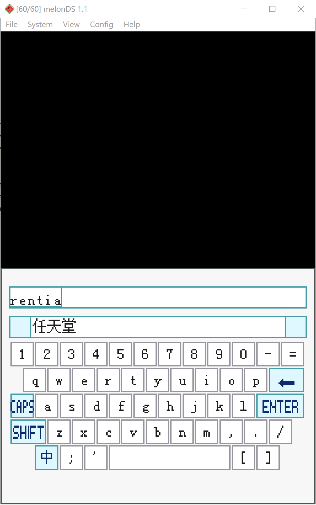
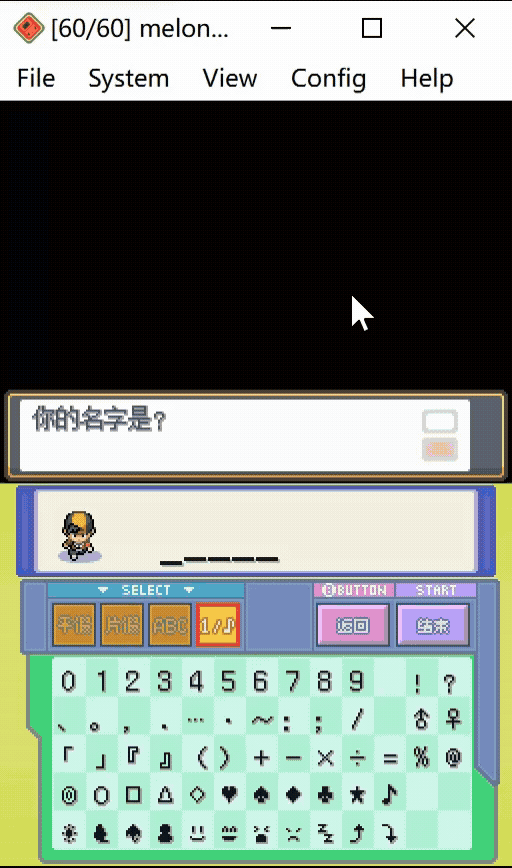
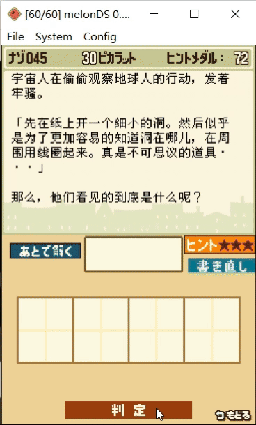
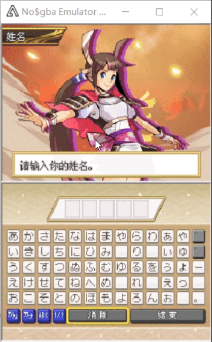
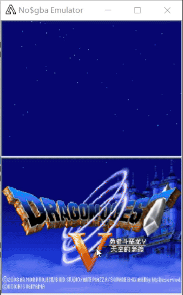

# Nitro Keyboard Plugin

Nitro Keyboard Plugin 是一个为 NDS 汉化游戏开发的、通用的中文输入键盘插件。

接入键盘插件后，可以在游戏内呼出键盘进行输入。

> **2026 年 9 月 27 日更新**
>
> 《宝可梦 黑/白》适配版 v7.9.31-E 发布：
>
> - 全套中文键盘：拼音输入 + 候选词选择（支持翻页）
> - 十字键 + A/B 完整键盘导航（1.8 秒步进、↑ 出界跳入候选区、↓ 返回键盘）
> - 触摸 / 按键光标双向同步
> - 触摸退出防误触（抬笔确认）
>
> 成品补丁与打补丁教程见下文[《宝可梦 黑/白》适配版](#宝可梦-黑白适配版)。

> **2026 年 8 月 8 日更新**
>
> 新增可选的扩展拼音输入法：
>
> - 支持词语拼写，同时检索单字和词语候选
> - 候选字词通过触摸直接输入，并可点击左右箭头翻页
> - 使用适合 NDS 低内存环境的两级 `pinyin_db.bin`，按需读取词库数据
> - 默认词库来自 [rime-pinyin-simp](https://github.com/rime/rime-pinyin-simp)，也可以导入经 `pypinyin` 生成并人工校对的自定义 Rime YAML 词库
>
> 在 `config.mk` 中设置 `ENABLE_KEYBOARD_PINYIN_EX=1` 即可启用；默认值仍为 `0`，继续使用原有拼音输入法。词库生成和放置方法请参阅[接入文档](docs/HowToBuild.md)。

> **2026 年 5 月 8 日更新**
>
> 支持插入编辑，并且可以设置初始字符，效果见下图。

## 效果演示

<table>
  <tr>
    <th colspan="2">扩展拼音输入法（美化版）</th>
  </tr>
  <tr>
    <td colspan="2" align="center"></td>
  </tr>
  <tr>
    <th>心金</th>
    <th>雷顿教授</th>
  </tr>
  <tr>
    <td align="center"></td>
    <td align="center"></td>
  </tr>
  <tr>
    <th>宝可梦信长</th>
    <th>勇者斗恶龙 5</th>
  </tr>
  <tr>
    <td align="center"></td>
    <td align="center"></td>
  </tr>
</table>

像雷顿教授这种使用手写输入的游戏，也可以使用中文来回答了。

## 宝可梦 黑/白 适配版

针对《精灵宝可梦 黑/白》简体汉化版（ver.2.1.8）的完整适配，通过 overlay 钩点 + kmod 注入的方式接入键盘插件，不修改 SDK / bootstrap。

- **打补丁教程**：[docs/patch_tutorial.md](docs/patch_tutorial.md)（[HTML 版](docs/patch_tutorial.html)）
  - Windows：把未补丁 ROM 拖到补丁器 exe 上即可（补丁已内嵌，零依赖）
  - Linux / macOS：`xdelta3 -d -s 原版.nds 补丁.xdelta 输出.nds`
  - 打补丁前请务必核对教程中的基础 ROM MD5
- **成品补丁**：请到 [Releases](../../releases) 下载（仓库本身不含 ROM 或补丁成品）
- **适配说明**：[docs/BW_KEYBOARD_ADAPTATION_GUIDE.md](docs/BW_KEYBOARD_ADAPTATION_GUIDE.md)
- **维护者须知**：ROM 文本更新后重走构建链的完整清单，见打补丁教程第八节

> ⚠️ 旧版补丁在 ROM 更新后立即作废。请始终以发布页公布的 MD5 为准。

## 演示补丁

雷顿教授的键盘插件演示补丁：

- 下载地址：[百度网盘](https://pan.baidu.com/s/1CLfQgl8Y-_R0AswGS3-7_Q)
- 提取码：`r7i3`
- 使用方法：使用 xdelta 工具，将补丁应用到《雷顿教授与不可思议的小镇》简体汉化版
- 呼出方式：在第 45 题"宇宙人之谜"的解答页面中，按下 `R + X` 键即可呼出中文键盘进行解答

## 接入文档

[查看接入文档](docs/HowToBuild.md)

接入遇到问题时，请提 issue。

## 仓库结构

```
├── keyboard_module/    # 键盘主模块（kmod）：输入法、光标、拼音引擎
├── overlay/            # 游戏侧 overlay 钩子（呼出/轮询/触摸）
├── overlay_ldr/        # overlay 加载器注入器
├── common/             # 公共构建配置与精简 NitroSDK 接口层
├── script/             # 资源生成工具（字体/词库/码表/键盘贴图）
├── patch.py 等         # BW 适配构建链（arm9/ov194/ov237 补丁与打包）
├── docs/               # 接入文档、BW 适配指南、打补丁教程
├── example/            # 其他游戏的接入示例（心金/雷顿/信长/DQ5）
└── third_party/        # rime-pinyin-simp 词库（git submodule）
```

## 从源码构建

前置：devkitPro（libnds ≥ 2.0.0）、Python 3 + [script/requirements.txt](script/requirements.txt)、[enler/ndstool](https://github.com/enler/ndstool)（TWL 打包与 xdelta 生成）。

```bash
git clone --recurse-submodules https://github.com/enler/NitroKeyboardPlugin.git
```

- 通用插件接入方法：[docs/HowToBuild.md](docs/HowToBuild.md)
- 宝可梦 黑/白 适配版构建链：见[打补丁教程](docs/patch_tutorial.md)第八节（维护者附录）

## 免责声明

本项目为 NDS 游戏汉化社区的输入法工具，不包含、也不分发任何游戏 ROM 或其他受版权保护的游戏资源。使用本项目需自备相应游戏 ROM；请支持正版游戏。本项目与 Nintendo / The Pokémon Company 无关。

## 资料引用

- 最初的灵感来源：[DSTWO 的 DS 游侠](http://chn.supercard.sc/manual/dstwo/dsyx.htm)，其中有一个简易的键盘供用户编辑金手指
- 重绘游戏画面的实现：一部分参考了 [nds-bootstrap](https://github.com/DS-Homebrew/nds-bootstrap) 的 inGameMenu 实现
- 扩展拼音输入法的默认词库：[rime-pinyin-simp](https://github.com/rime/rime-pinyin-simp)，本项目通过 Git submodule 引用
